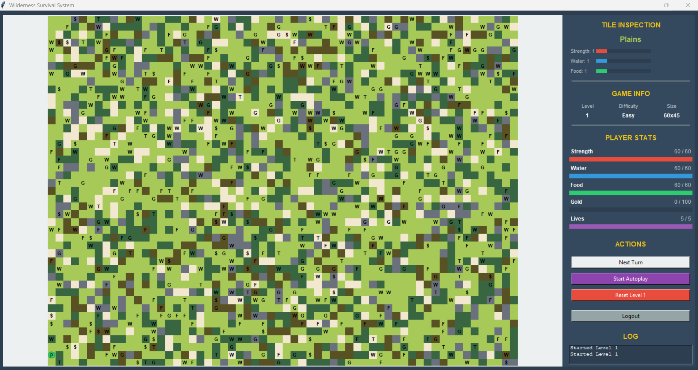

# Wilderness Survival System (WSS)

This application delivers a structured survival simulation where users navigate terrain, manage resources, and interact with traders. The system leverages modular architecture across core logic, game mechanics, and a GUI front end.



## CPP Fall 2025 CS3560 Group Project

Team 15 Members
- Long Nguyen
- Eulalia Pedro
- Kelly Lwin
- Nicholas Tran
- Vincent Terrelonge
- Andy Wu

## How to Run

1. Install Python 3.10+.
2. Run in final_code folder:

   ```
   python main.py
   ```

## How to Play

Players start on a generated map, move across terrain, and collect food, water, and gold while monitoring survival stats. Traders offer resource exchanges, and vision/brain systems drive movement strategy.